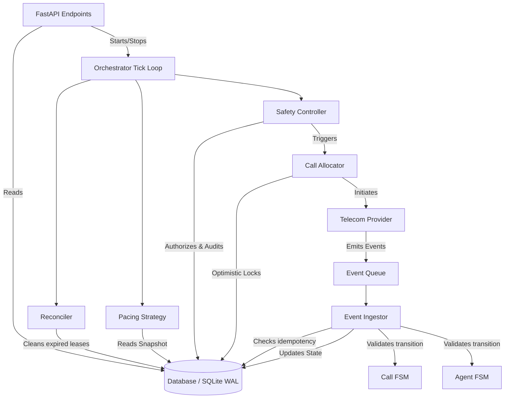
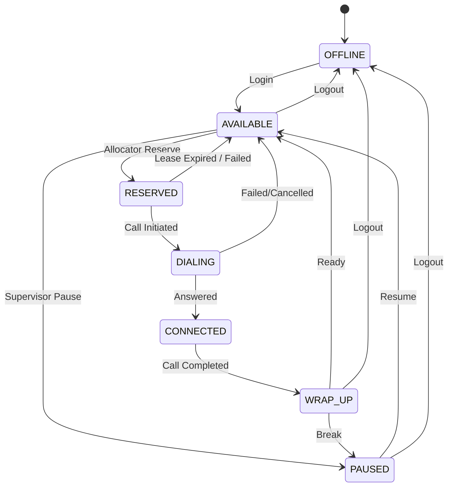
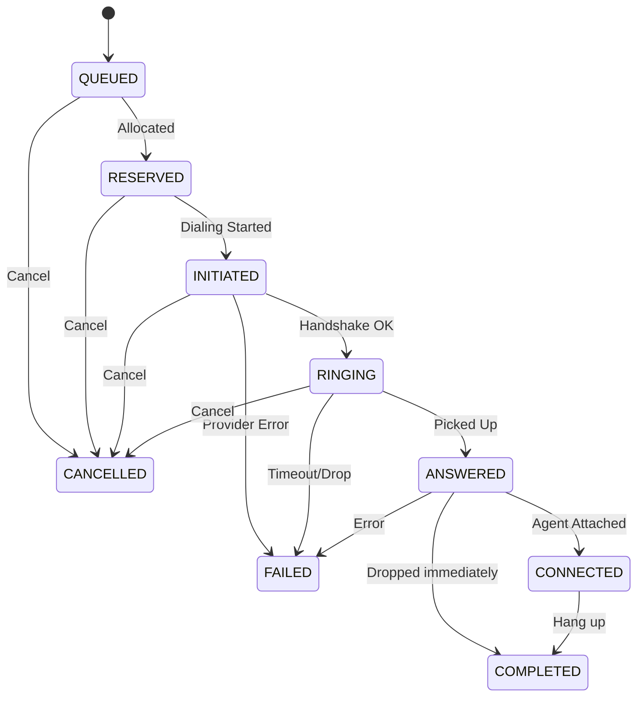

# SmartDialer Architecture

SmartDialer is a single-process, high-concurrency predictive dialer for call centers. It avoids complex microservice coordination, queues, or distributed state mechanisms (like Redis, Kafka, or Celery). Instead, it relies on a single relational database (SQLite in WAL mode by default, or Postgres) as its sole source of truth and coordination.

## Core Principles
1. **Single Source of Truth (Database):** All state, concurrency control, and audit trailing exist in the database.
2. **Stateless Components:** The pacing engine, safety controller, and event ingestor hold no persistent internal state across ticks (aside from tracking EWMA, which is synchronized).
3. **Optimistic Concurrency Control:** Worker threads compete to reserve agents and borrowers using database-level `UPDATE ... WHERE version = X` locks.
4. **FSM Enforcement:** Agents and calls follow strict Finite State Machines (FSMs). State changes outside these paths are rejected.

## Component Diagram

## Finite State Machines

### Agent FSM

### Call FSM

